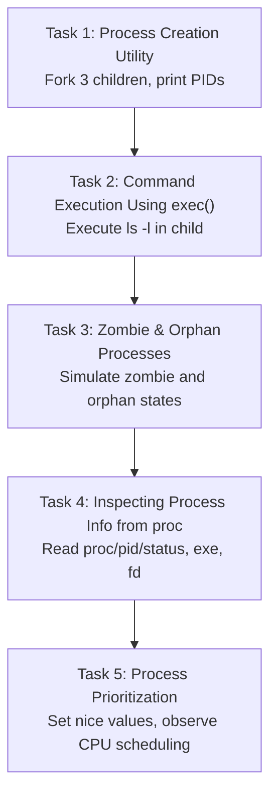

**Lab Assignment**
**Yatharth Chopra, BTech CSE Data Science, Sem 5, Roll No: 2301420022**

# OS Lab Experiment 1: Process Management

## Tasks Overview



## Task Details

- **Task 1**: Process Creation Utility - Fork 3 children, print PIDs and PPIDs
- **Task 2**: Command Execution Using exec() - Execute ls -l command in child process
- **Task 3**: Zombie & Orphan Processes - Simulate defunct zombie and orphaned child processes
- **Task 4**: Inspecting Process Info from /proc - Parse process status, executable path, and file descriptors
- **Task 5**: Process Prioritization - Demonstrate CPU scheduling with different nice values

## How to Run

```bash
python process_management.py
```

## Reference Files

- `process_management.py` - Main Python script with all task implementations
- `output.txt` - Sample output from running the tasks
- `OS_Lab_Assignment 1.docx` - Assignment document
- `report.pdf` - Lab report
- Screenshots: Various output captures